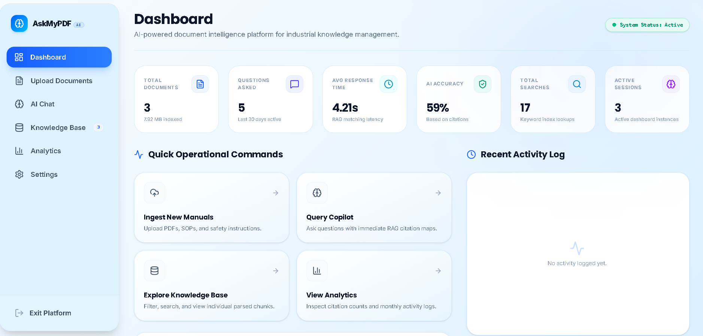
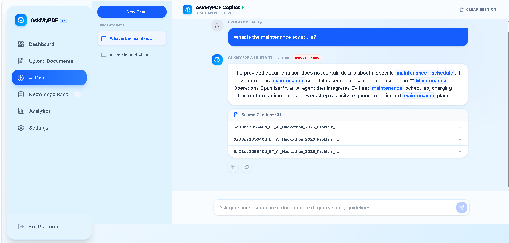
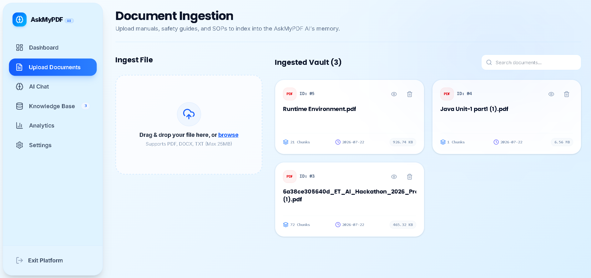
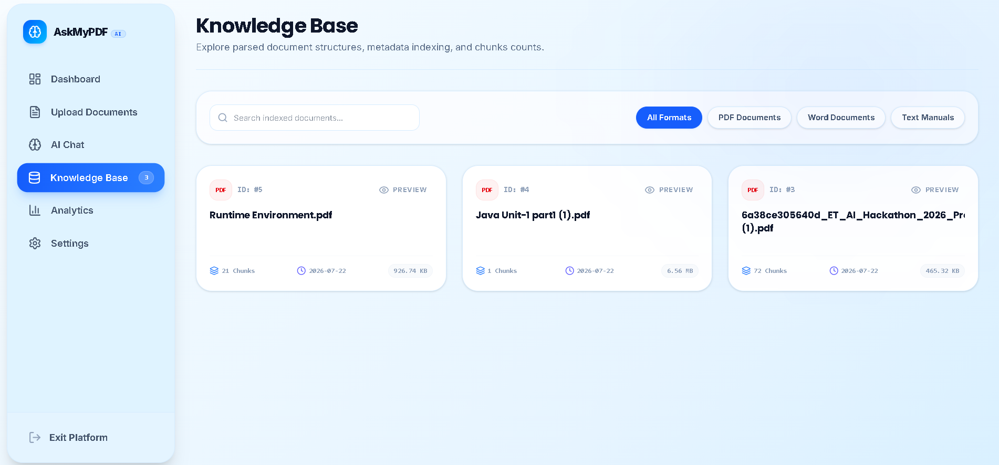
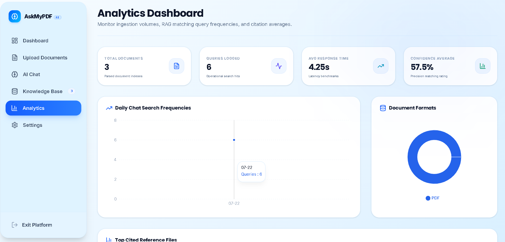

# 🚀 AskMyPDF AI

### Upload. Ask. Understand.

An AI-powered document intelligence platform that enables users to upload PDFs and technical documents, then ask natural language questions and receive AI-generated answers with source citations.

---

## 📖 Overview

AskMyPDF AI is a modern AI-powered document intelligence platform developed for **ET AI Hackathon 2026**.

The application helps engineers, technicians, researchers, and organizations search thousands of pages of technical documentation in seconds.

Instead of manually reading documents, users simply upload their files and ask questions like:

- What is the maintenance schedule?
- Summarize this document.
- Explain the safety procedure.
- What are the recommended technologies?

The system retrieves relevant information and generates accurate AI-powered responses.

---

## ✨ Features

- 📄 PDF, DOCX & TXT Upload
- 🤖 AI-powered Document Chat
- 🔍 Semantic Document Search
- 📚 Multi-document Knowledge Base
- 📑 Automatic Text Chunking
- 📍 Source Citations
- 📊 Analytics Dashboard
- 📈 Document Statistics
- 🎨 Premium Responsive UI
- 🌙 Light/Dark Theme
- ⚡ Fast Document Retrieval

---

# 🖥️ Application Preview

> Add screenshots here after deployment.

## Dashboard



## AI Chat



## Upload Documents



## Knowledge Base



---

## Analytics



---

# 🏗️ System Architecture

```
                User
                  │
                  ▼
         React + TypeScript
                  │
                  ▼
             Flask API
                  │
      ┌───────────┴───────────┐
      ▼                       ▼
Document Processing     Google Gemini API
      │
      ▼
Chunking + Embeddings
      │
      ▼
 Vector Database
      │
      ▼
AI Generated Answer
```

---

# ⚙️ Tech Stack

## Frontend

- React
- TypeScript
- Vite
- Tailwind CSS
- Framer Motion
- Lucide React
- Recharts

## Backend

- Python
- Flask
- Flask CORS
- SQLite
- PyPDF
- python-docx

## AI

- Google Gemini API
- Gemini Embeddings
- Retrieval-Augmented Generation (RAG)

---

# 📂 Folder Structure

```
AskMyPDF-AI
│
├── backend
│   ├── app.py
│   ├── db.py
│   ├── vector_store.py
│   ├── document_processor.py
│   └── requirements.txt
│
├── frontend
│   ├── src
│   ├── public
│   ├── package.json
│   └── vite.config.ts
│
├── .env.example
├── .gitignore
└── README.md
```

---

# 🚀 Installation

## Clone Repository

```bash
git clone https://github.com/Varshita1210/AskMyPDF-AI.git
```

---

## Backend

```bash
cd backend

python -m venv venv

# Windows
venv\Scripts\activate

# Linux/macOS
source venv/bin/activate

pip install -r requirements.txt

python app.py
```

---

## Frontend

```bash
cd frontend

npm install

npm run dev
```

---

# 🔑 Environment Variables

Create a `.env` file inside the backend folder.

```env
GEMINI_API_KEY=YOUR_GEMINI_API_KEY
```

---

# 📊 Workflow

```
Upload PDF

      │

      ▼

Extract Text

      │

      ▼

Chunk Document

      │

      ▼

Generate Embeddings

      │

      ▼

Store Vector

      │

      ▼

Ask Question

      │

      ▼

Retrieve Relevant Chunks

      │

      ▼

Gemini AI

      │

      ▼

Answer with Citation
```

---

# 🎯 Future Enhancements

- Voice Assistant
- OCR for Scanned Documents
- Multi-language Support
- Knowledge Graph
- Team Collaboration
- Cloud Deployment
- AI Document Summarization
- Enterprise Authentication

---

# 👨‍💻 Developed For

**ET AI Hackathon 2026**

Problem Statement 8

**AI for Industrial Knowledge Intelligence: Unified Asset & Operations Brain**

---

# 📄 License

MIT License

---

## ⭐ If you like this project, give it a star!